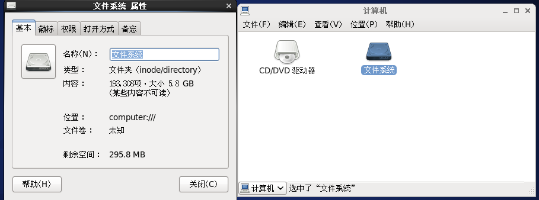
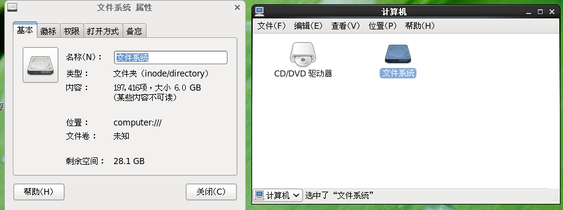

# 快捷键启动terminal

```
gnome-terminal
```

# Linux扩容/分区

```
df -lh
fdisk -l
fdisk /dev/sda 
reboot
mkfs.ext4 /dev/sda3
pvcreate /dev/sda3
vgdisplay
gvextend zu /dev/sda3
lvdisplay
lvextend -l +100%FREE /dev/vg_ysqcentos/lv_root
e2fsck -f /dev/vg_ysqcentos/lv_root
resize2fs /dev/vg_ysqcentos/lv_root
df -lh
```

# 扩容前




# 扩容后




# 参考

https://blog.csdn.net/cdmamata/article/details/50325303

**嫌麻烦也可直接复制我扩容后的linux**


# 安装kibana

```
sudo docker pull docker.elastic.co/kibana/kibana:7.0.1
sudo docker run --name kibana --link es00:elasticsearch -p 5601:5601 -d docker.elastic.co/kibana/kibana:7.0.1
```

